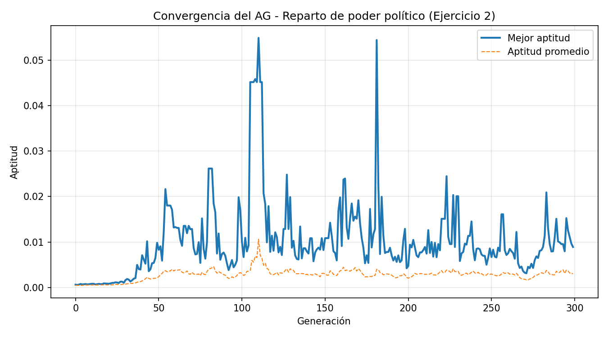

# Ejercicio 2 — Algoritmo Genético: "Verdadera Democracia" (Reparto de Poder Político)

Implementación de un **Algoritmo Genético Simple (AGS)** en Python, para
resolver un problema de reparto proporcional de poder entre partidos
políticos.

## Enunciado

> Suponga que usted es el jefe de gobierno y está interesado en que pasen
> los proyectos de su programa político. Sin embargo, en el congreso
> conformado por 5 partidos, no es fácil su tránsito, por lo que debe
> repartir el poder, conformado por ministerios y otras agencias del
> gobierno, con base en la representación de cada partido. Cada entidad
> estatal tiene un peso de poder, que es el que se debe distribuir.
> Suponga que hay 50 curules, distribuya aleatoriamente, con una
> distribución no uniforme entre los 5 partidos esas curules. Defina una
> lista de 50 entidades y asígneles aleatoriamente un peso político de 1
> a 100 puntos. Cree una matriz de poder para repartir ese poder, usando
> AGs.

## Contenido del repositorio

| Archivo | Descripción |
|---|---|
| `ejercicio2_ag_democracia.py` | Script en Python con el AG implementado |
| `convergencia_ejercicio2.png` | Gráfica de convergencia (aptitud por generación) |

## ¿Cómo funciona el Algoritmo Genético?

Un Algoritmo Genético es una técnica de optimización inspirada en la
selección natural: se mantiene una **población** de soluciones candidatas
(cromosomas), que evoluciona generación tras generación aplicando tres
operadores:

1. **Selección** — los individuos más aptos tienen mayor probabilidad de
   convertirse en padres de la siguiente generación (selección por
   ruleta).
2. **Cruce** — se combinan partes de dos cromosomas padres para producir
   dos cromosomas hijos.
3. **Mutación** — con una probabilidad baja, se altera aleatoriamente
   algún gen del cromosoma, para mantener diversidad genética y evitar
   quedar atrapado en óptimos locales.

## Diseño de este AG (siguiendo los 6 pasos clásicos de diseño)

### 1. Definición del problema
Hay 5 partidos con distinta cantidad de curules (de 50 totales,
repartidas al azar de forma no uniforme). Hay 50 entidades del Estado
(ministerios, agencias, etc.), cada una con un peso político aleatorio
(1-100). Hay que **asignar cada entidad a un partido**, de modo que el
poder total que reciba cada partido sea proporcional a su cantidad de
curules (a más curules, más poder debería recibir).

### 2. Representación del cromosoma
A diferencia de un AG binario clásico, aquí cada gen es un **entero**
(no un bit), porque el problema lo pide naturalmente así:

```
cromosoma = [p_0, p_1, p_2, ..., p_49]     donde p_i ∈ {1, 2, 3, 4, 5}
```

El gen `i` indica a qué partido se asigna la entidad `i`. Es una lista
de 50 genes, uno por cada entidad estatal.

### 3. Función de aptitud
Primero se calcula el **poder ideal** de cada partido, proporcional a
sus curules:

$$\text{poder\_ideal}_p = \text{poder\_total} \times \frac{\text{curules}_p}{50}$$

Luego, dado un cromosoma, se calcula el **poder real** que recibe cada
partido (sumando los pesos de las entidades que le fueron asignadas), y
se mide qué tan lejos está del ideal:

$$\text{diferencia} = \sum_{p=1}^{5} |\text{poder\_real}_p - \text{poder\_ideal}_p|$$

$$\text{Aptitud} = \frac{1}{1 + \text{diferencia}}$$

Se usa esta transformación (en vez de la diferencia directa) porque el
AG necesita una aptitud que **crezca** cuando la solución mejora — como
se busca *minimizar* la diferencia, se invierte con `1/(1+diferencia)`,
garantizando además que la aptitud sea siempre positiva (requisito para
la selección por ruleta).

### 4. Operadores genéticos
- **Selección**: por ruleta — la probabilidad de que un individuo sea
  seleccionado como padre es proporcional a su aptitud respecto al
  total de la población.
- **Cruce**: de un punto — se elige una posición al azar dentro de la
  lista de 50 genes y se intercambian las asignaciones posteriores a
  ese punto entre la pareja de padres.
- **Mutación**: por gen — cada gen tiene una probabilidad fija
  (`pm = 5%`) de reasignarse a un partido distinto, elegido al azar.

### 5. Criterio de parada
Número fijo de generaciones (`M = 300`), como recomienda el documento
para problemas de tipo combinatorio, donde no se puede conocer de
antemano la solución óptima exacta debido a la explosión combinatoria
($5^{50}$ combinaciones posibles).

### 6. Parámetros usados
| Parámetro | Valor |
|---|---|
| `K` (individuos en la población) | 40 |
| `M` (número de generaciones) | 300 |
| `pm` (probabilidad de mutación) | 5% |

## Código

```python
"""
Ejercicio 2 - "Verdadera democracia"
------------------------------------
Se reparten 50 curules de forma no uniforme entre 5 partidos.
Se generan 50 entidades estatales, cada una con un peso politico
aleatorio entre 1 y 100 puntos.

El AG debe asignar cada una de las 50 entidades a uno de los 5
partidos, de manera que el poder total (suma de pesos) que recibe
cada partido sea lo mas proporcional posible a la cantidad de
curules que tiene ese partido en el congreso.

Diseno del AG (siguiendo los 6 pasos de la seccion 3.8 del documento):
1. Problema:      minimizar la diferencia entre el poder real
                   asignado a cada partido y su poder "ideal"
                   (proporcional a sus curules).
2. Representacion: cromosoma = lista de 50 genes enteros (1 a 5),
                   el gen i indica a que partido se asigna la
                   entidad i. (Tipo de dato entero, no binario).
3. Operadores:     seleccion por ruleta, cruce en un punto,
                   mutacion (reasignar el gen a un partido al azar).
4. Aptitud:        Aptitud = 1 / (1 + diferencia_total)
                   (positivo siempre, mayor aptitud = menor diferencia)
5. Criterio parada: numero fijo de generaciones (tipico en problemas
                   combinatorios, seccion 3.8.1 punto 5 del documento).
6. Parametros:     K = 40 individuos, M = 300 generaciones, pm = 5%.
"""

import random

# ---------------------------------------------------------------
# PARAMETROS DEL PROBLEMA
# ---------------------------------------------------------------
N_ENTIDADES = 50
N_PARTIDOS = 5
TOTAL_CURULES = 50

# ---------------------------------------------------------------
# PARAMETROS DEL AG
# ---------------------------------------------------------------
K = 40          # individuos en la poblacion
M = 300         # numero de generaciones
PM = 0.05       # probabilidad de mutacion

random.seed(42)  # para que el resultado sea reproducible


# ---------------------------------------------------------------
# 1) DATOS DEL PROBLEMA
# ---------------------------------------------------------------
def generar_curules(total=TOTAL_CURULES, partidos=N_PARTIDOS):
    """Reparte 'total' curules de forma NO uniforme entre 'partidos'."""
    cortes = sorted(random.sample(range(1, total), partidos - 1))
    limites = [0] + cortes + [total]
    curules = [limites[i + 1] - limites[i] for i in range(partidos)]
    return curules


def generar_entidades(n=N_ENTIDADES):
    """Genera n entidades con un peso politico aleatorio entre 1 y 100."""
    return [random.randint(1, 100) for _ in range(n)]


# ---------------------------------------------------------------
# 2) POBLACION (cromosomas de enteros, no binarios)
# ---------------------------------------------------------------
def generar_poblacion(k=K, n=N_ENTIDADES, partidos=N_PARTIDOS):
    return [[random.randint(1, partidos) for _ in range(n)] for _ in range(k)]


# ---------------------------------------------------------------
# 3) FUNCION DE APTITUD
# ---------------------------------------------------------------
def poder_ideal(curules, poder_total, partidos=N_PARTIDOS):
    """Poder que 'deberia' recibir cada partido, proporcional a sus curules."""
    return [poder_total * curules[p] / TOTAL_CURULES for p in range(partidos)]


def evaluar(cromosoma, pesos, ideal, partidos=N_PARTIDOS):
    poder_real = [0.0] * partidos
    for entidad, partido in enumerate(cromosoma):
        poder_real[partido - 1] += pesos[entidad]
    diferencia = sum(abs(poder_real[p] - ideal[p]) for p in range(partidos))
    aptitud = 1 / (1 + diferencia)
    return aptitud, diferencia, poder_real


def eval_poblacion(pob, pesos, ideal):
    aptitudes = []
    for crom in pob:
        apt, _, _ = evaluar(crom, pesos, ideal)
        aptitudes.append(apt)
    return aptitudes


# ---------------------------------------------------------------
# 4) SELECCION POR RULETA
# ---------------------------------------------------------------
def seleccion(pob, aptitudes):
    total = sum(aptitudes)
    probab = [a / total for a in aptitudes]
    acumulado = []
    s = 0.0
    for p in probab:
        s += p
        acumulado.append(s)

    seleccionados = []
    for _ in range(len(pob)):
        r = random.random()
        for i, lim in enumerate(acumulado):
            if r <= lim:
                seleccionados.append(pob[i][:])
                break
    return seleccionados


# ---------------------------------------------------------------
# 5) CRUCE EN UN PUNTO
# ---------------------------------------------------------------
def cruce(seleccionados, l=N_ENTIDADES):
    hijos = []
    i = 0
    while i < len(seleccionados):
        p1 = seleccionados[i]
        p2 = seleccionados[i + 1] if i + 1 < len(seleccionados) else seleccionados[0]
        pt = random.randint(1, l - 1)
        h1 = p1[:pt] + p2[pt:]
        h2 = p2[:pt] + p1[pt:]
        hijos.append(h1)
        hijos.append(h2)
        i += 2
    return hijos[:len(seleccionados)]


# ---------------------------------------------------------------
# 6) MUTACION
# ---------------------------------------------------------------
def mutacion(hijos, pm=PM, partidos=N_PARTIDOS):
    for crom in hijos:
        for i in range(len(crom)):
            if random.random() < pm:
                crom[i] = random.randint(1, partidos)
    return hijos


# ---------------------------------------------------------------
# RUTINA PRINCIPAL DEL AG
# ---------------------------------------------------------------
def algoritmo_genetico():
    curules = generar_curules()
    pesos = generar_entidades()
    poder_total = sum(pesos)
    ideal = poder_ideal(curules, poder_total)

    pob = generar_poblacion()
    historial_mejor = []
    historial_promedio = []

    mejor_crom_global = None
    mejor_apt_global = -1

    for gen in range(M):
        aptitudes = eval_poblacion(pob, pesos, ideal)

        # guardar estadisticas de esta generacion
        mejor_idx = aptitudes.index(max(aptitudes))
        historial_mejor.append(aptitudes[mejor_idx])
        historial_promedio.append(sum(aptitudes) / len(aptitudes))

        if aptitudes[mejor_idx] > mejor_apt_global:
            mejor_apt_global = aptitudes[mejor_idx]
            mejor_crom_global = pob[mejor_idx][:]

        seleccionados = seleccion(pob, aptitudes)
        hijos = cruce(seleccionados)
        pob = mutacion(hijos)

    return {
        "curules": curules,
        "pesos": pesos,
        "poder_total": poder_total,
        "ideal": ideal,
        "mejor_cromosoma": mejor_crom_global,
        "mejor_aptitud": mejor_apt_global,
        "historial_mejor": historial_mejor,
        "historial_promedio": historial_promedio,
    }


# ---------------------------------------------------------------
# REPORTE DE RESULTADOS
# ---------------------------------------------------------------
def imprimir_resultados(res):
    partidos_nombres = [f"Partido {i+1}" for i in range(N_PARTIDOS)]

    print("=" * 60)
    print("DATOS DEL PROBLEMA")
    print("=" * 60)
    print(f"Curules por partido : {res['curules']}  (total = {sum(res['curules'])})")
    print(f"Poder politico total (suma de pesos de las 50 entidades): {res['poder_total']}")
    print()

    print("=" * 60)
    print("RESULTADO DEL ALGORITMO GENETICO")
    print("=" * 60)
    apt, diferencia, poder_real = evaluar(res["mejor_cromosoma"], res["pesos"], res["ideal"])
    print(f"Mejor aptitud encontrada : {apt:.6f}")
    print(f"Diferencia total (poder real vs ideal): {diferencia:.2f}")
    print()

    print(f"{'Partido':<12}{'Curules':>9}{'Poder ideal':>14}{'Poder real':>14}{'Diferencia':>13}")
    for p in range(N_PARTIDOS):
        print(f"{partidos_nombres[p]:<12}{res['curules'][p]:>9}"
              f"{res['ideal'][p]:>14.2f}{poder_real[p]:>14.2f}"
              f"{abs(poder_real[p]-res['ideal'][p]):>13.2f}")

    print()
    print("Asignacion de entidades a partidos (entidad -> partido):")
    asign = res["mejor_cromosoma"]
    for p in range(1, N_PARTIDOS + 1):
        entidades_de_p = [i for i, part in enumerate(asign) if part == p]
        print(f"  {partidos_nombres[p-1]}: {len(entidades_de_p)} entidades -> {entidades_de_p}")


# ---------------------------------------------------------------
# GRAFICA DE CONVERGENCIA (como las figuras del documento, seccion 7)
# ---------------------------------------------------------------
def graficar_convergencia(res, out_path):
    import matplotlib
    matplotlib.use("Agg")
    import matplotlib.pyplot as plt

    plt.figure(figsize=(9, 5))
    plt.plot(res["historial_mejor"], label="Mejor aptitud", linewidth=2)
    plt.plot(res["historial_promedio"], label="Aptitud promedio", linewidth=1, linestyle="--")
    plt.xlabel("Generación")
    plt.ylabel("Aptitud")
    plt.title("Convergencia del AG - Reparto de poder político (Ejercicio 2)")
    plt.legend()
    plt.grid(alpha=0.3)
    plt.tight_layout()
    plt.savefig(out_path, dpi=150)
    print(f"\nGrafica guardada en: {out_path}")


if __name__ == "__main__":
    resultado = algoritmo_genetico()
    imprimir_resultados(resultado)
    graficar_convergencia(resultado, "/mnt/user-data/outputs/convergencia_ejercicio2.png")
```

## Resultado

| Curules por partido | Poder total a repartir |
|---|---|
| `[2, 6, 33, 7, 2]` | 2358 puntos |

| Partido | Curules | Poder ideal | Poder real | Diferencia |
|---|---|---|---|---|
| Partido 1 | 2 | 94.32 | 93.00 | 1.32 |
| Partido 2 | 6 | 282.96 | 282.00 | 0.96 |
| Partido 3 | 33 | 1556.28 | 1560.00 | 3.72 |
| Partido 4 | 7 | 330.12 | 335.00 | 4.88 |
| Partido 5 | 2 | 94.32 | 88.00 | 6.32 |

**Diferencia total: 17.20** sobre un poder total de 2358 puntos, es
decir, un error de apenas **~0.73%** — un resultado muy cercano al
reparto perfectamente proporcional, logrado sobre un espacio de
búsqueda de $5^{50}$ combinaciones posibles.



## Referencias

- Holland, J. (1975). *Adaptation in Natural and Artificial Systems*.
- Goldberg, D. (1989). *Genetic Algorithms in Search, Optimization and
  Machine Learning*. Addison Wesley.
