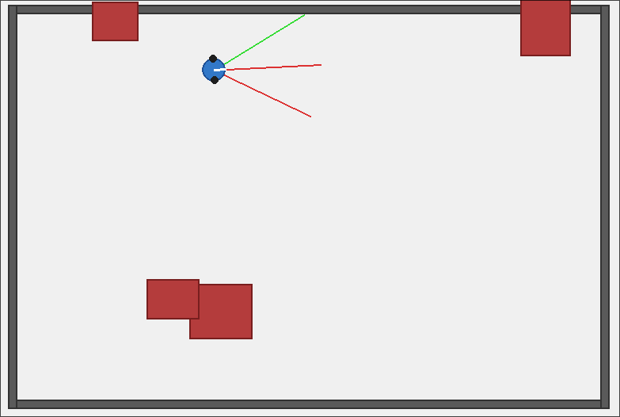

## Ejercicio 2/3

Enunciado:

Simule el comportamiento de un robot con tres sensores de distancia, que recorre un espacio bidimensional, donde hay 4 objetos distribuidos aleatoriamente.

Solucion:

```bash
cd ./robot
python -m venv .venv
.venv/bin/pip install -r requirements.txt

# Ejecucion
.venv/bin/python robot.py
```

Ejemplo de Ejecucion



Para la realizacion de este programa se importan las librerias de `pygame`, `math`, `random` y `sys`. Posteriormente se definen las constantes del programa, como lo son el tamaño de la ventana, el número de obstaculos, los fps, colores, etc.

Luego se definen 2 clases. Primero la clase obstaculo, que son los objetos que aparecen aleatoriamente en la escena. Y segundo, el robot, que tiene varias caracteristicas, como lo son la velocidad de ambas ruedas, posición, sensores.

```python
class Obstaculo:
    def __init__(self, x, y, w, h, color=OBSTACLE_COLOR, border=(120, 30, 30)):
        self.rect = pygame.Rect(x, y, w, h)
        self.color = color
        self.border = border

    def draw(self, surface):
        pygame.draw.rect(surface, self.color, self.rect)
        pygame.draw.rect(surface, self.border, self.rect, 2)


class Robot:
    def __init__(self, x, y):
        self.x = x
        self.y = y
        self.theta = 0.0
        self.vl = 0.0
        self.vr = 0.0
        self.wheel_base = ROBOT_RADIUS * 1.8

    def set_vl(self, v):
        self.vl = max(-MAX_SPEED, min(MAX_SPEED, v))

    def set_vr(self, v):
        self.vr = max(-MAX_SPEED, min(MAX_SPEED, v))
```

El código tiene más utilidades que ayudan para la colision entre los sensores y los objetos en escena, la generación de la escena, y la generación de los obstaculos.

```python
def ray_vs_rect(ox, oy, dx, dy, rect):
    inv_dx = 1.0 / dx if dx != 0 else float('inf')
    inv_dy = 1.0 / dy if dy != 0 else float('inf')

    t1 = (rect.left - ox) * inv_dx
    t2 = (rect.right - ox) * inv_dx
    t3 = (rect.top - oy) * inv_dy
    t4 = (rect.bottom - oy) * inv_dy

    tmin = max(min(t1, t2), min(t3, t4))
    tmax = min(max(t1, t2), max(t3, t4))

    if tmax < 0:
        return None
    if tmin > tmax:
        return None
    if tmin < 0:
        tmin = tmax
    if tmin < 0:
        return None
    return tmin
```

finalmente, entra el bucle principal de pygame, en donde el robot constantemente obtiene lectura de los sensores y dependiendo de esa lectura avanza o gira para derecha o para la izquierda. En caso de que tenga una señal de los tres sensores, el robot girará hacia la derecha.

```python
while True:
  readings = robot.get_sensor_readings(obstaculos)

  if not paused:
    left_dist, left_hit = readings[0]
    center_dist, center_hit = readings[1]
    right_dist, right_hit = readings[2]

    if left_hit and center_hit and right_hit:
      vl = 0.0
      vr = BASE_SPEED
    else:
      norm_left = 1.0 - left_dist / SENSOR_RANGE
      norm_right = 1.0 - right_dist / SENSOR_RANGE
      norm_center = 1.0 - center_dist / SENSOR_RANGE

      vl = BASE_SPEED - norm_left * 2.5 - norm_center * 1.5
      vr = BASE_SPEED - norm_right * 2.5 - norm_center * 1.5

    robot.set_vl(vl)
    robot.set_vr(vr)
    robot.apply_diff_drive()

    readings = robot.get_sensor_readings(obstaculos)
```

