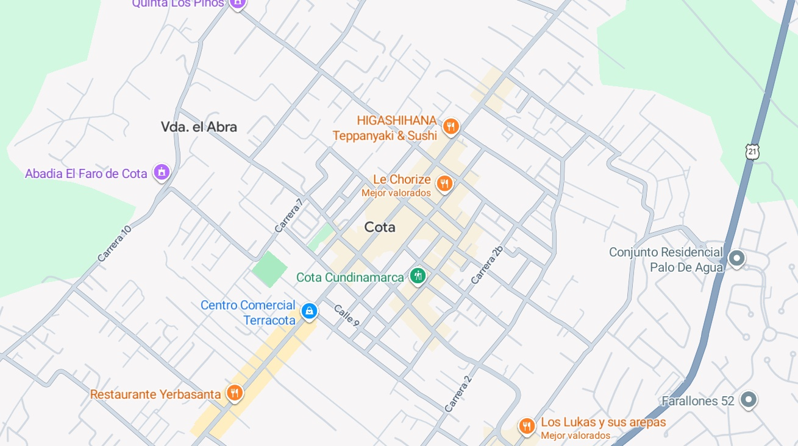
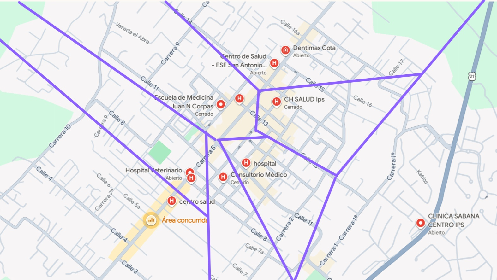

## Ejercicio 4

Para la realización del ejercicio 4 se tomó como base el mapa de cota

### Centros de Salud

El diagrama de Voronoi de los centros de salud obtenido fue el siguiente

Como se puede observar, practicamente todos los
centros de salud se encuentran en el centro de
la ciudad, a excepción de solo un centro medico.

Con esto en mente, despues de realizar el diagrama
de Voronoi para los centros de salud en cota hace
falta, en general, aumentar la dispersion de los
centros de salud para que zonas no tan centrales
tengan facil acceso a estos centros.
