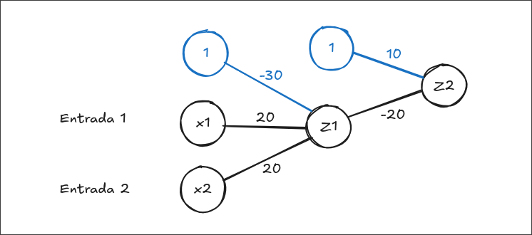
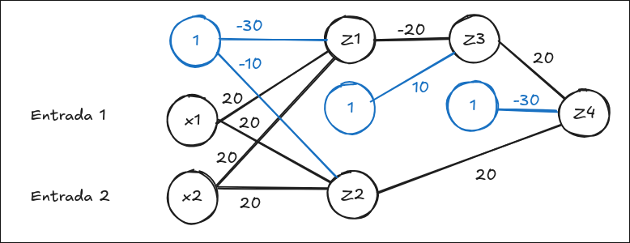

# Ejercicio 01

Desarrolle dos redes neuronales con 2 capas ocultas.
Una que aprenda a reconocer una compuerta NAND, y la
otra que aprenda a reconocer una compuerta XOR.

## Compuerta NAND

La primera compuerta es simple. x1 y x2 son las dos
entradas. Son solo 2 fases. La primera para evaluar
el AND y el segundo para negarlo.

|x1|x2| b |w1|w2| Z1|g(Z)|
|--|--|---|--|--|---|----|
| 0| 0|-30|20|20|-30|   0|
| 0| 1|-30|20|20|-10|   0|
| 1| 0|-30|20|20|-10|   0|
| 1| 1|-30|20|20| 10|   1|

|Z1| b | w | Z2|g(Z)|
|--|---|---|---|----|
| 0| 10|-20| 10|   1|
| 1| 10|-20|-10|   0|

## Compuerta XOR

Esta Compuerta es más compleja. Tiene 2 capas ocultas
y se separa en dos partes. La primera (Z1) es un AND.
La segunda (Z2) es un OR. Luego la compuerta AND Z1
se niega y por último Z2 y Z3 pasan a otra compuerta
AND para obtener el XOR.

|x1|x2| b |w1|w2| Z1|g(Z)|
|--|--|---|--|--|---|----|
| 0| 0|-30|20|20|-30|   0|
| 0| 1|-30|20|20|-10|   0|
| 1| 0|-30|20|20|-10|   0|
| 1| 1|-30|20|20| 10|   1|

|x1|x2| b |w1|w2| Z2|g(Z)|
|--|--|---|--|--|---|----|
| 0| 0|-10|20|20|-10|   0|
| 0| 1|-10|20|20| 10|   1|
| 1| 0|-10|20|20| 10|   1|
| 1| 1|-10|20|20| 30|   1|

|Z1| b | w | Z3|g(Z)|
|--|---|---|---|----|
| 0| 10|-20| 10|   1|
| 1| 10|-20|-10|   0|

|Z3|Z2| b |w1|w2| Z1|g(Z)|
|--|--|---|--|--|---|----|
| 0| 0|-30|20|20|-30|   0|
| 0| 1|-30|20|20|-10|   0|
| 1| 0|-30|20|20|-10|   0|
| 1| 1|-30|20|20| 10|   1|
